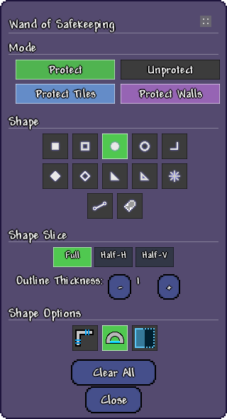
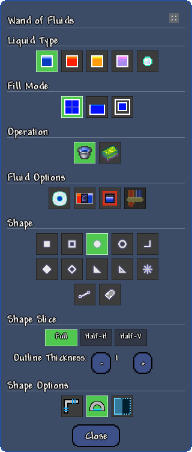
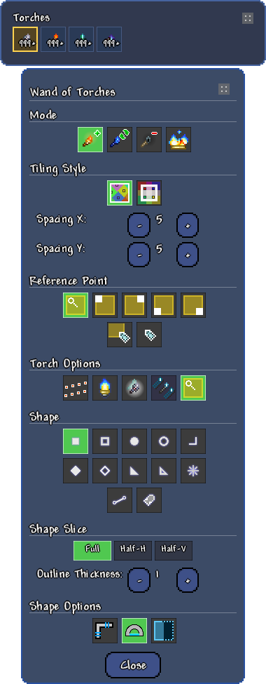
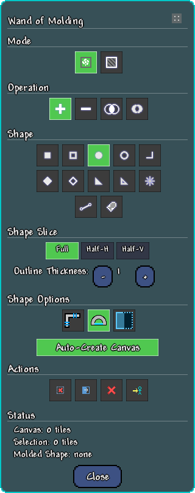
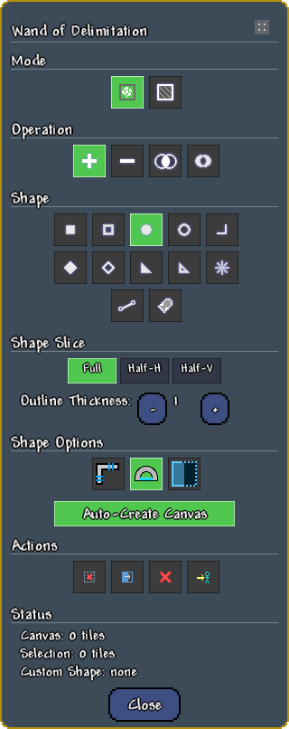

# World Shaping Wands — Showcase

> Visual demonstrations of every major feature. All assets live in [`ShowcaseAssets/`](ShowcaseAssets/).
> *Last refreshed: 2026-04-26 (Phase 4.3 docs overhaul) — content matches v1.0.0 release state (10 wand families × 4 modes + 2 Torch Wheel wands = 44 items).*

---

## The Ten Wand Families

All 42 cycling wands organised by family — each family has four selection modes (Instant, Select, Confirm, Stamp). Right-click any wand in inventory to cycle modes.

| Family | Overlay colour | Purpose |
|--------|----------------|---------|
| **Building** | Green | Bulk tile / wall / platform / rope / slope / planter / grass-seed placement |
| **Dismantling** | Red | Mass tile & wall destruction with container handling and Void Everything |
| **Replacement** | Purple | Swap one tile / wall / object type for another in bulk |
| **Wiring** | Yellow | Bulk wire (red / green / blue / yellow) and actuator placement / removal |
| **Safekeeping** | Cyan / Magenta / Gold | Mark tiles & walls as protected — every other wand respects them |
| **Coating** | Teal | Paint, illuminant, echo (tri-state), scrape, harvest moss, repaint |
| **Fluids** | Liquid-aware (water blue, lava orange, honey amber, shimmer violet) | Fill / drain / mix the four vanilla liquids; bubble blocks; selective drain |
| **Torches** | Warm yellow | Manhattan / Grid lattice torch placement, biome-aware, 7 reference modes |
| **Molding** | Teal canvas | Sculpt custom shapes — exposed as the **Mold** shape in every other wand |
| **Delimitation** | Cyan canvas | Define an area that all other wands are clipped to |

Plus the **standalone Torch Wheel Wand** (Solid + Platform variants) — a fire-and-forget projectile that wall-follows and drops torches at fixed spacing.

For per-family deep dives, see the [User Guides](UserGuides/Wands/) folder.

---

## Shape Gallery

Eight shape types, each available in Filled and Hollow modes with configurable outline thickness, slicing (Full / HalfHorizontal / HalfVertical), Equal Dimensions lock, Connect Diameter, and Invert Selection.

| # | Shape | Algorithm |
|---|-------|-----------|
| 1 | **Rectangle** | Bounding-box fill |
| 2 | **Ellipse** | `Math.Sqrt` rasterisation |
| 3 | **Diamond** | Manhattan distance with ×2 integer arithmetic |
| 4 | **Triangle** | Scanline fill with degenerate-case handling |
| 5 | **Elbow** | Two-segment L-shape (axis chosen by first mouse movement) |
| 6 | **Cardinal Line** | 8-direction snap with circular brush |
| 7 | **Straight Line** | Free-angle Bresenham line with variable-thickness brush |
| 8 | **Mold** | User-sculpted custom shape from the Wand of Molding canvas — reusable across every wand |

Half-shapes are produced by **Shape Slicing** (HalfHorizontal / HalfVertical) applied to any shape, replacing what used to be dedicated half-shape entries.

---

## Mode Cycling

Right-click a wand in your inventory to cycle through the four selection modes. The wand's icon updates to match the active mode.

| Mode | Behaviour |
|------|-----------|
| **Instant** | Click-drag-release to execute immediately |
| **Select** | Click start → click end → executes |
| **Confirm** | Click start → click end → preview → click to commit, right-click to cancel |
| **Stamp** | Click start → click end → confirm anchor → stamp the same shape repeatedly |

See [Common Concepts → Selection Modes](UserGuides/CommonConcepts.md#selection-modes) for the full breakdown.

---

## Wand of Building

Bulk placement of 8 object types (solid blocks, platforms, ropes, planter boxes, grass seeds, walls, sloped tiles, half-blocks) with paint sprayer integration, actuation tri-state, and configurable block-exhaustion behaviour.

### Settings panel

**Highlights:**
- Object type selector (Solid · Platform · Rope · Wall · Slope · HalfBlock · GrassSeed · PlanterBox)
- Per-PlaceType chosen-item dictionary (each sub-mode owns its own item slot)
- Slope picker (Full / Half / 4 corner slopes) with **OverwriteSlope** toggle
- **Actuation** tri-state (Ignore / Apply / Remove)
- **Paint Sprayer** tri-state (CoatingSettings / Inventory / Off)
- **Block Exhaustion Mode** dropdown (NextBlock / Cancel / Interrupt)

Full guide: [WandOfBuilding](UserGuides/Wands/WandOfBuilding.md)

---

## Wand of Dismantling

Mass tile / wall destruction with vanilla pick-power validation, demon altar / delicate tile guards, container handling (chests, barrels, locked-chest unlocking), and a **Carefree + Void Everything** sandbox shortcut.

### Settings panel

**Highlights:**
- Destroy Tiles / Destroy Walls / Destroy Chests independent toggles
- **Void Everything** (Carefree-gated) — clears all tile data without kill effects
- Full shape selector with slice / thickness / equal-dimensions / connect-diameter / invert
- Progressive-processing visualisation in singleplayer
- Per-position protection check (Safekeeping integration)

Full guide: [WandOfDismantling](UserGuides/Wands/WandOfDismantling.md)

---

## Wand of Replacement

Swap one tile / wall / object type for another across an entire selection. Five object types (Tile / Platform / Rope / PlanterBox / Wall) plus Air. SameType mode for class-wide swaps. Per-ObjectType chosen-item dictionaries. PreservePaint toggle. PaintSprayer tri-state. Substrate-variant detection. Support detection prevents collapse cascades.

### Settings panel

**Highlights:**
- Source Type and Target Type selectors (independent ObjectType per side)
- **SameType Mode** for in-place type swaps within a class (replace any tile with any other tile)
- **Air** as a target for bulk erasure
- **PreservePaint** toggle — keep existing paint when swapping
- **Paint Sprayer** tri-state
- Two-pass replacement algorithm (collect-then-apply) prevents in-pass aliasing

Full guide: [WandOfReplacement](UserGuides/Wands/WandOfReplacement.md)

---

## Wand of Wiring

Bulk wire and actuator placement / removal — supports all four wire colours plus the actuator layer, simultaneously. Defaults to the **Elbow** shape (thickness 1) for vanilla Grand Design parity.

### Settings panel

**Highlights:**
- Five independent layer toggles (Red / Green / Blue / Yellow / Actuator), packed to 1 byte for efficient MP sync
- Place / Remove mode switch (Remove drops wires back as items)
- Default Elbow shape with thickness 1 — Grand Design parity out of the box
- All-off guard: skips operation cleanly if no layer is selected

Full guide: [WandOfWiring](UserGuides/Wands/WandOfWiring.md)

---

## Wand of Safekeeping

Mark tiles and walls as protected; every other wand silently skips protected positions. Independent tile / wall layer toggles. Persists across world saves via `TagCompound`. Server-authoritative in MP.

### Settings panel

**Overlay legend** (visible only while holding the Wand of Safekeeping):

| Colour | Meaning |
|--------|---------|
| **Cyan** | Tile-only protection |
| **Magenta** | Wall-only protection |
| **Gold** | Both tile and wall protected |

**Workflow:**
1. Select an area with the Wand of Safekeeping (Protect mode) to lock it.
2. Other wands skip protected positions, reporting the count in the post-op chat summary.
3. Switch to Unprotect mode and sweep the same shape to unlock.

Full guide: [WandOfSafekeeping](UserGuides/Wands/WandOfSafekeeping.md)

---

## Wand of Coating

Paint tiles and walls (30 colours), apply or strip Illuminant and Echo coatings via tri-state toggles, scrape and harvest moss in bulk. Acts as the **paint source** for Building / Replacement's Paint Sprayer.

### Settings panel

**Modes:**
- **Paint Tile** — apply paint colour to tile foreground
- **Paint Wall** — apply paint colour to background wall
- **Scrape** — remove paint
- **Harvest Moss** — remove moss and drop it as items

**Coating tri-states:**
- **Illuminant** — Ignore / Apply / Remove
- **Echo** — Ignore / Apply / Remove

Plus a **Repaint** toggle for forced re-application even when the target colour matches.

Full guide: [WandOfCoating](UserGuides/Wands/WandOfCoating.md)

---

## Wand of Fluids

Fill, drain, and mix the four vanilla liquids (Water / Lava / Honey / Shimmer). Three fill algorithms. Bubble Blocks with Coat-in-Bubble containment. SelectiveDrain per liquid type. Custom liquid-aware overlay colours.

### Settings panel

**Highlights:**
- 4 liquid types with per-liquid overlay colour
- 3 fill algorithms: **FullLiquid** (raw fill), **RainFill** (gravity-aware), **PocketFill** (cavity-aware)
- **Bubble Blocks** + **Coat-in-Bubble** for sealed underwater bases
- **Mix vs Overwrite** toggle for liquid-on-liquid behaviour
- **SelectiveDrain** — drain only one specific liquid type, leave others untouched

Full guide: [WandOfFluids](UserGuides/Wands/WandOfFluids.md)

---

## Wand of Torches

Lay torches on a Manhattan or Grid lattice with configurable spacing. 4 modes (Place / Replace / Remove / Convert). 7 reference modes for the lattice seed. Echo Coat tri-state. Biome torch + smart inventory lookup. Align-to-existing snap.

### Settings panel

**Highlights:**
- **Tiling Style** — Manhattan (diamond lattice) or Grid (rectangular)
- Independent **SpacingX** and **SpacingY** sliders
- 7 **Reference Modes** for the lattice seed (FirstValidTile / 4 bbox corners / FirstClick / MousePos)
- **AlignToExistingTorches** — extends an existing lighting pass without re-aligning
- **BiomeTorch** + **SmartBiomeTorchLookup** — auto-pick biome variants when Torch God's Favour is active
- **EchoCoat** tri-state — apply or strip Echo while placing
- Hardmode-gated evil torches with optional Coral Torch substitution

Full guide: [WandOfTorches](UserGuides/Wands/WandOfTorches.md)

---

## Torch Wheel Wand (standalone)

A fire-and-forget projectile that sticks to a wall surface and drops torches at configurable spacing as it rolls along it. Two variants — **Solid** (block walls / ceilings / floors) and **Platform** — swap via right-click in inventory.

**Highlights:**
- Configurable spacing (default 12 for Solid, 8 for Platform), max-torches (50), max-tiles (150), backtrack steps (20)
- Smart underwater handling (`UnderwaterTorchLookup`, `AutoWaterproofTorches`)
- Smart biome handling (`SmartBiomeTorchLookup`) preserves your collected biome torch stacks
- Smooth velocity-based "firefly" trajectory (`SmoothVisualPath`)
- Animated grey→gold sprite (`AnimateTorchWheel`) with photosensitivity warning for very tight spacing
- **Shift + Right-click** while holding the wand kills all your active wheels (panic button)

Full guide: [TorchWheelWand](UserGuides/Wands/TorchWheelWand.md)

---

## Wand of Molding

Sculpt a custom shape inside a working canvas; the resulting **Mold** is exposed as a shape entry in every other wand family for stamp-mode reuse.

### Settings panel

**Core ideas:**
- **Canvas** — the maximum bounding region the mold can occupy (teal/cyan overlay)
- **Mold selection** — the actual tile offsets that make up the shape
- **Auto-promotion** — the mold is always live as a custom shape; no export step needed

**Operations** (in both Selection and Canvas Edit mode):

| Operation | Effect on selection | Effect on canvas (Edit mode) |
|-----------|---------------------|------------------------------|
| **Add (Union)** | Adds tiles to the mold | Expands the canvas |
| **Remove (Subtract)** | Removes tiles from the mold | Shrinks the canvas |
| **Intersect** | Keeps only overlapping tiles | Canvas becomes the intersection |
| **XOR (Toggle)** | Flips tile membership | Toggles canvas tiles |

Full guide: [WandOfMolding](UserGuides/Wands/WandOfMolding.md)

---

## Wand of Delimitation

Define an area that **every other wand** is clipped to. The same canvas + selection architecture as Molding, but the output bounds operations rather than producing a custom shape.

### Settings panel

**Highlights:**
- Add / Remove / Intersect / XOR operations to build an arbitrary region
- A "no action" warning surfaces when a wand operation produces zero changes because the entire shape fell outside the delimitation area
- 60-frame channel threshold prevents instant warnings during active selection
- Persists per-player across world saves

Full guide: [WandOfDelimitation](UserGuides/Wands/WandOfDelimitation.md)

---

## Stamp Mode Deep Dive

The 4-click stamp workflow for repeatable pattern placement.

| Click | Action |
|-------|--------|
| **1** | Start selection corner |
| **2** | Set end corner — shape locks |
| **3** | Lock anchor position |
| **4+** | Stamp the shape at new locations |
| **Right-click (mid-selection)** | Reset |
| **Backspace (Undo Selection Step)** | Step back one click |

Pair Stamp mode with Molding's **Mold** shape for arbitrary repeatable templates: sculpt a window once, stamp 12 times along a tower; sculpt a circuit footprint, wire it across an entire floor.

---

## Configuration

The mod ships **10 separate `ModConfig` panels** (split for clarity) — see [Common Concepts → Configuration at a glance](UserGuides/CommonConcepts.md#configuration-at-a-glance) for the full table.

| Panel | Side | Purpose |
|-------|------|---------|
| **ResourcesConfig** | Server | Infinite tiles / walls / wires / actuators / grass seeds; drop suppression |
| **SandboxConfig** | Server | Pickaxe-power bypass, demon altar / delicate tile guards, vacuum, locked-key behaviour |
| **CarefreeConfig** | Server | Carefree preset + Void Everything availability |
| **LimitsConfig** | Server | Max operation size, selection caps, thickness cap, MP cooldown |
| **PerformanceConfig** | Server | Progressive batched processing, batch size, frame delay |
| **StampConfig** | Server | Stamp repeat intervals (general + Coating-specific) |
| **TorchWheelConfig** | Server | Torch Wheel + Wand-of-Torches tuning (spacing, smart-torch, biome gates) |
| **OverlayConfig** | Client | Selection overlay colours, render mode, opacity |
| **CanvasOverlayConfig** | Client | Molding + Delimitation overlay colours, dimming alpha |
| **PreferencesConfig** | Client | Wand sounds, lore tooltips, infinite-resource per-type overrides, undo stack depth |

---

## Localization

Ships in **9 locales**: English (complete), German, Spanish, French, Italian, Polish, Portuguese, Russian, Chinese (structural placeholders for community translation). The `Scripts/update_localization.py` helper supports bulk key propagation across all 9 locales.

---

## Keybinds

| Default key | Action |
|-------------|--------|
| `]` | Increase outline thickness |
| `[` | Decrease outline thickness |
| `.` | Toggle held wand's settings panel |
| `Backspace` | Undo last wand operation |
| `;` | Toggle suppress drops |

Plus right-click in inventory (mode cycle), right-click while held (panel / cancel), and Shift + Right-click on the Torch Wheel (kill all active wheels).

---

## Asset coverage

The visual gallery currently includes:

- ✅ Action GIFs: Building, Dismantling, Replacement, Wiring, Safekeeping, Mode Cycling, Stamp Mode, Shapes
- ✅ Settings panel screenshots: all 10 wand families (`*_ui.png`)
- ✅ Inventory overview: `showcase_wands_inventory.png`
- ⏳ Action GIFs *pending capture*: Coating, Fluids, Torches, TorchWheel, Molding, Delimitation (queued for v1.0.0 polish pass per `dev_notes/planning/DeferredForNextSession.md` UI Showcase Coverage Gap)

---

*Capture protocol: [`dev_notes/content/ShowcaseScript.md`](dev_notes/content/ShowcaseScript.md). All images and GIFs live in [`ShowcaseAssets/`](ShowcaseAssets/) (excluded from the mod build via `.tModIgnore`).*
