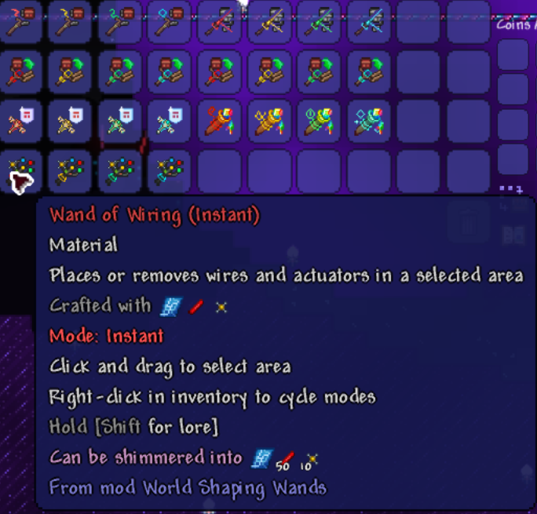
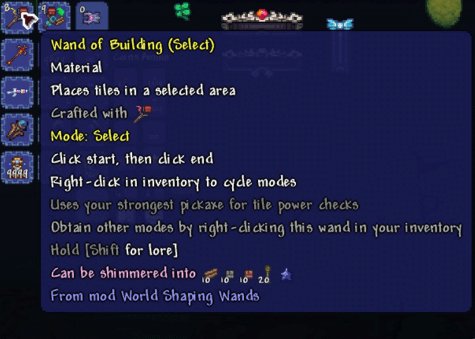
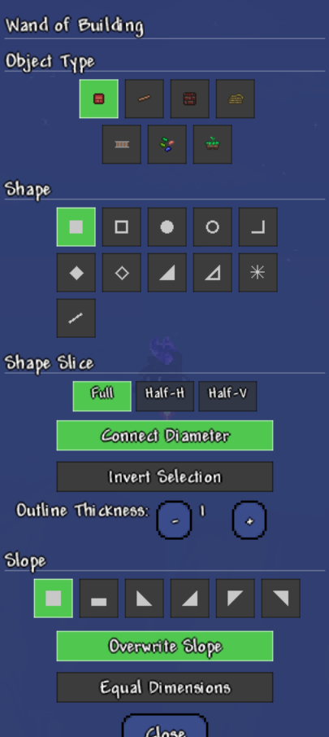
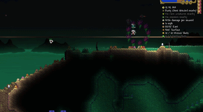
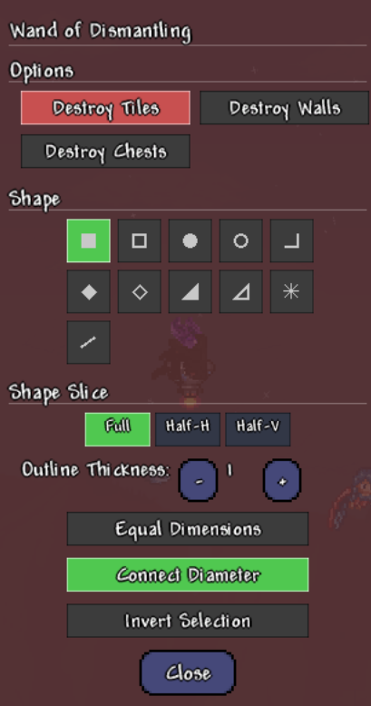
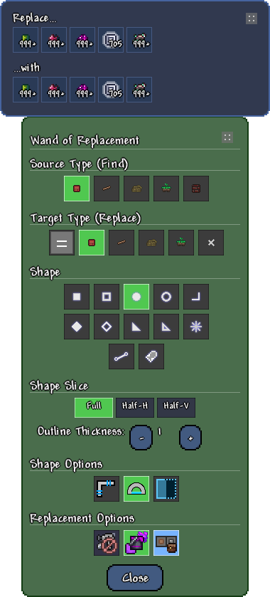
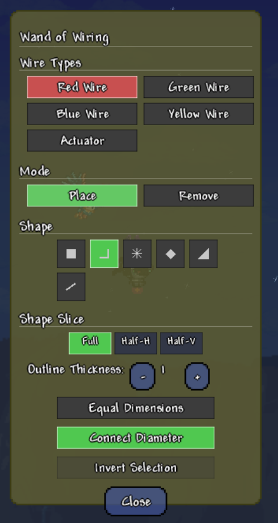
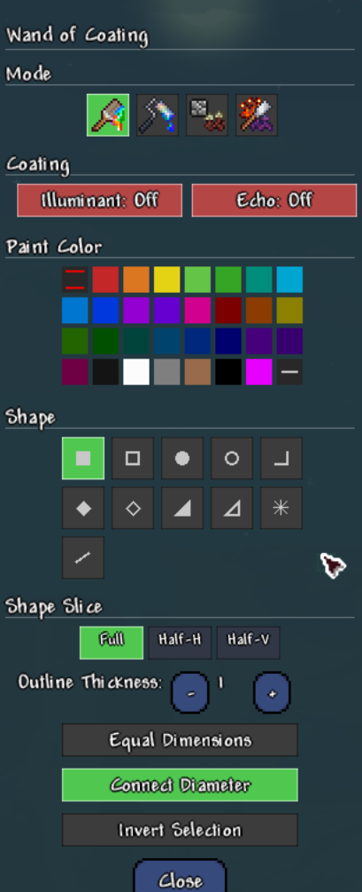

# World Shaping Wands — Showcase

> Visual demonstrations of every major feature. All assets live in `ShowcaseAssets/`.

---

## The Six Wand Families

All 24 wands organised by family — each family has four selection modes (Instant, Select, Confirm, Stamp).

| Family | Colour | Purpose |
|--------|--------|---------|
| **Building** | Green | Bulk tile / wall / platform / rope / rail placement |
| **Dismantling** | Red | Mass tile & wall destruction |
| **Replacement** | Purple | Swap one tile / wall type for another |
| **Wiring** | Yellow | Bulk wire & actuator placement / removal |
| **Safekeeping** | Cyan | Protect / unprotect tiles from wand operations |
| **Coating** | Teal | Paint, illuminant, echo, moss operations |

---

## Shape Gallery

Seven shape types, each available in Filled and/or Hollow mode with configurable outline thickness, slicing (Full / HalfH / HalfV), and equal-dimensions lock.

Shapes demonstrated:
1. **Rectangle** — Filled & Hollow
2. **Ellipse** — Filled & Hollow
3. **Diamond** — Filled & Hollow
4. **Triangle** — Filled & Hollow
5. **Elbow** — Two-segment L-shape
6. **Cardinal Line** — 8-direction snap with circular brush
7. **Straight Line** — Free-angle Bresenham with variable-thickness brush

Half-shapes are created by applying **Shape Slicing** (HalfHorizontal / HalfVertical) to any of the above.

---

## Mode Cycling

Right-click a wand in your inventory to cycle through all four selection modes.

| Mode | Behaviour |
|------|-----------|
| **Instant** | Click-drag to execute immediately |
| **Select** | Click start, click end → executes |
| **Confirm** | Click start, click end → preview overlay → click to confirm |
| **Stamp** | Define template → lock anchor → stamp repeatedly |

---

## Building Wand

Bulk tile placement with slope control, paint sprayer, actuation, and block-swap support.

### Settings Panel

**Features shown:**
- Object type selector (Solid Block, Platform, Rope, Rail, Grass Seed, Planter Box, Wall)
- Slope selector (Full, Half, ◣ ◢ ◤ ◥)
- Shape & thickness controls
- Overwrite Slope toggle
- Paint Sprayer toggle (auto-paints placed tiles with held paint)
- Actuation toggle (Ignore / Apply / Remove)
- Block exhaustion mode (NextBlock / Interrupt / Cancel)

---

## Dismantling Wand

Mass tile and wall destruction with progressive batching, vacuum collection, and container handling.

### Settings Panel

**Features shown:**
- Destroy Tiles / Destroy Walls / Destroy Chests / Void Everything toggles
- Full shape selector with slice & thickness
- Equal Dimensions, Connect Diameter, Invert Selection options
Missing:
- Void Everything (Carefree Mode only): clears all tile data without kill effects

---

## Replacement Wand

Swap one tile type for another across an entire selection — preserves slope and half-block state.

### Settings Panel

**Features shown:**
- Source Type selector (what to find)
- Target Type selector (what to replace with)
- Same Type mode for in-place operations
- Air (Remove) target for bulk erasure

---

## Wiring Wand

Bulk wire and actuator placement or removal — supports all four wire colours simultaneously.

### Settings Panel

**Features shown:**
- Wire colour toggles (Red, Green, Blue, Yellow)
- Actuator toggle
- Place / Remove mode switch
- Full shape selector

---

## Safekeeping Wand

Protect tiles from all wand operations — protected tiles glow with a distinct overlay.

**Workflow:**
1. Select an area with the Safekeeping wand to **protect** it
2. Protected tiles are skipped by Building, Dismantling, Replacement, and Coating wands
3. Use the Safekeeping wand again to **unprotect**

---

## Coating Wand

Paint tiles and walls, apply illuminant and echo coatings, scrape paint, and harvest moss — all in bulk.

### Settings Panel

**Modes:**
- **Paint Tile** — Apply paint colour to tiles
- **Paint Wall** — Apply paint colour to walls
- **Scrape Moss** — Remove moss from stone surfaces
- **Harvest Moss** — Remove moss and drop it as items

**Coating options:** Illuminant and Echo tri-state toggles (Ignore / Apply / Remove), Repaint toggle

---

## Stamp Mode Deep Dive

The 4-click stamp workflow for repeatable pattern placement.

| Click | Action |
|-------|--------|
| **1** | Start selection corner |
| **2** | Set end corner — shape locks |
| **3** | Lock anchor position |
| **4+** | Stamp the shape at new locations |
| **Right-click** | Reset / go back one step |

---

## Configuration

All wands share a server-synced configuration (`WandConfig`) with sections for:

- **Selection Caps** — Limit selection size per shape mode (Small / Big / Hollow)
- **Sandbox** — Suppress Drops, Bypass Pickaxe Power, Allow Demon Altar Destruction, Allow Delicate Tile Destruction, Ignore Locked Key Requirements, Auto-Open Chests, Vacuum Items
- **Carefree Mode** — Sandbox preset that enables suppress drops, bypass pick power, allow demon altars, allow delicate tiles, and unlocks Void Everything
- **Progressive Mode** — Batch size and delay for large operations
- **Outline Thickness** — Max allowed outline thickness

Client-side config (`WandClientConfig`) controls:
- Wand sounds
- Overlay colours and opacity

---

## Keybinds

| Default Key | Action |
|-------------|--------|
| `]` | Increase Thickness |
| `[` | Decrease Thickness |
| `.` | Open Wand Settings |
| `Backspace` | Undo Selection Step |
| `;` | Toggle Suppress Drops |

---

*Assets recorded following the [Showcase Script](dev_notes/content/ShowcaseScript.md). All images and GIFs are stored in `ShowcaseAssets/` (excluded from mod build via `.tModIgnore`).*
